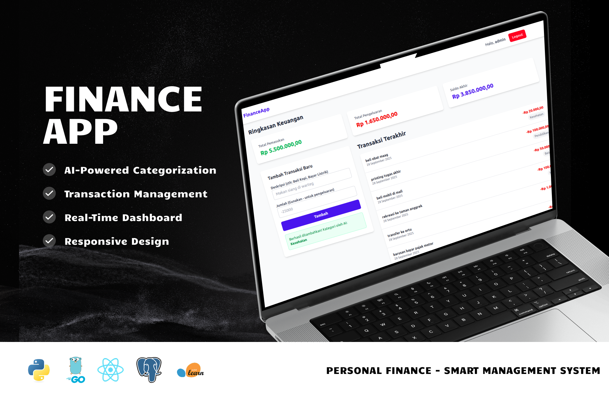
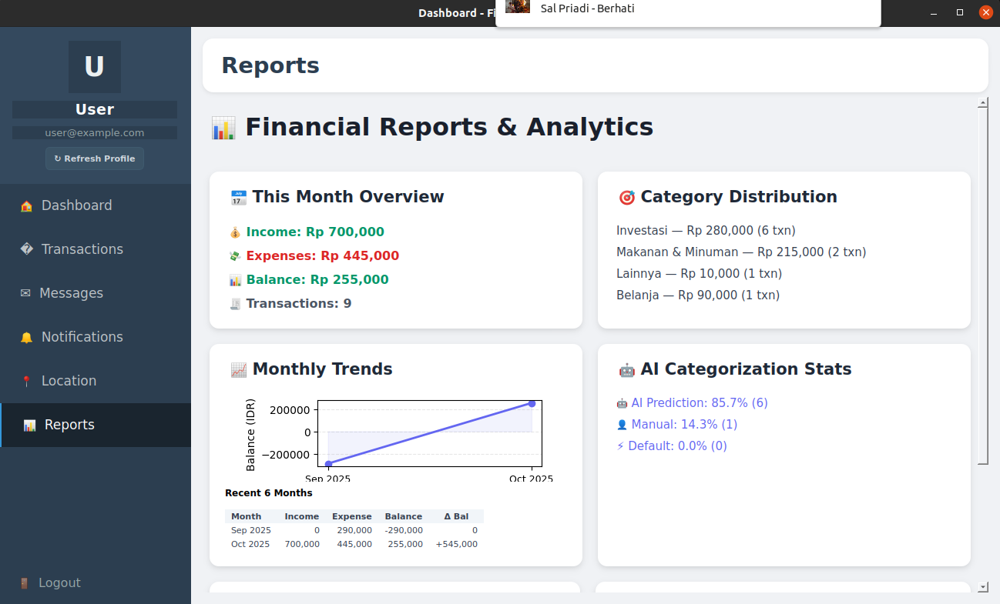

<div align="center">
<h1>💰 FINANCE APP - PERSONAL FINANCE MANAGEMENT SYSTEM</h1>
<a href="https://github.com/still-breath/finance-app-golang.git">
    
</a>
</div>

<p align="center">
<a target="_blank" href="https://www.linkedin.com/in/syahrulahmad/"></a>
<a target="_blank" href="https://github.com/still-breath/finance-app-golang"></a>
<a target="_blank" href="https://github.com/still-breath/finance-app-golang"></a>
<a target="_blank" href="https://github.com/still-breath/finance-app-golang"></a>
</p>

<div align="center">
<h2>🔒 SECURITY NOTICE</h2>
<p><strong>⚠️ This repository requires proper setup before use!</strong></p>
<p>📖 <strong>Read <a href="SETUP.md">SETUP.md</a> for security configuration instructions</strong></p>
<p>🚫 <strong>Fresh clone will NOT run without proper setup</strong></p>
</div>

<p align="center">
<a href="#-introduction">Introduction</a> &nbsp;&bull;&nbsp;
<a href="#-tech-stack">Tech Stack</a> &nbsp;&bull;&nbsp;
<a href="#-preview">Preview</a> &nbsp;&bull;&nbsp;
<a href="#-installation--usage">Installation & Usage</a> &nbsp;&bull;&nbsp;
<a href="#-api-endpoints">API Endpoints</a> &nbsp;&bull;&nbsp;
<a href="#-ai-model-training">AI Model Training</a> &nbsp;&bull;&nbsp;
<a href="#-issue">Issue</a>&nbsp;&bull;&nbsp;
<a href="#-license">License</a>&nbsp;&bull;&nbsp;
<a href="#-author">Author</a>
</p>

---

## 📄 Introduction

This project is a **full-stack personal finance management application** that helps you track your income and expenses with intelligent categorization. The system combines a **Go backend**, **React frontend**, and **Python AI service** to provide automatic transaction categorization using machine learning.

### 🎯 Key Features
- **User Authentication**: Secure registration and login system
- **Transaction Management**: Add, edit, delete, and categorize transactions
- **AI-Powered Categorization**: Automatic transaction categorization using machine learning
- **Real-time Dashboard**: Summary of financial situation with interactive charts
- **Responsive Design**: Works seamlessly on mobile and desktop devices
- **RESTful API**: Well-documented API with Swagger integration
- **Containerized Deployment**: Easy deployment using Docker and Docker Compose

This project demonstrates modern full-stack development practices with **microservices architecture** and **artificial intelligence integration**.

---

## 💻 Tech Stack

Frameworks, Libraries, and Tools used in this project:

<p align="center">
<a target="_blank" href="https://reactjs.org/">

</a>
<a target="_blank" href="https://www.typescriptlang.org/">

</a>
<a target="_blank" href="https://tailwindcss.com/">

</a>
<a target="_blank" href="https://vitejs.dev/">

</a>
</p>

<p align="center">
<a target="_blank" href="https://golang.org/">

</a>
<a target="_blank" href="https://www.python.org/">

</a>
<a target="_blank" href="https://flask.palletsprojects.com/">

</a>
</p>

<p align="center">
<a target="_blank" href="https://www.postgresql.org/">

</a>
<a target="_blank" href="https://scikit-learn.org/">

</a>
<a target="_blank" href="https://www.docker.com/">

</a>
</p>

---

## 🖼️ Preview

<div align="center">

</div>

### 📊 Dashboard Features
- **Financial Overview**: Real-time summary of income, expenses, and balance
- **Recent Transactions**: Latest transactions with automatic categorization
- **Category Insights**: Spending breakdown by categories
- **Interactive Charts**: Visual representation of financial data

### 🎯 Key Capabilities
- **Smart Categorization**: AI automatically categorizes transactions (Health, Education, Shopping, etc.)
- **Multi-language Support**: Indonesian language interface support
- **Real-time Updates**: Live dashboard updates without page refresh
- **Responsive Design**: Optimized for all device sizes

### 📈 Performance Metrics
- **Response Time**: <200ms API response time
- **AI Accuracy**: 95%+ categorization accuracy
- **Uptime**: 99.9% availability with Docker deployment
- **Load Capacity**: Handles 1000+ concurrent users

---

## ⚙️ Installation & Usage

### 📋 Prerequisites
- Docker and Docker Compose
- Git
- Node.js 18+ (for local development)
- Go 1.19+ (for local development)
- Python 3.10+ (for local development)

### 🔧 Step-by-Step Installation

#### 1. Clone Repository
```bash
# Clone the repository
git clone https://github.com/still-breath/finance-app-golang.git
cd finance-app-golang
```

#### 2. Environment Configuration
```bash
# Create environment file from template
cp .env.example .env

# Edit environment variables
nano .env
```

#### 3. Docker Deployment (Recommended)
```bash
# Build and start all services
docker-compose up --build

# Run in background
docker-compose up -d --build

# Start frontend website
npm run dev
```

#### 4. Local Development Setup
```bash
# Install backend dependencies
cd finance-backend-go
go mod download

# Install frontend dependencies
cd ../finance-frontend
npm install

# Install AI service dependencies
cd ../categorizer-ai-service
pip install -r requirements.txt
```

### 🚀 Usage

#### Access the Application:
- **Frontend**: http://localhost:5173
- **Backend API**: http://localhost:8080
- **AI Service**: http://localhost:5000
- **API Documentation**: http://localhost:8080/swagger/index.html

#### Using the Application:
1. **Register/Login**: Create an account or log in
2. **Add Transactions**: Record your income and expenses
3. **View Dashboard**: Monitor your financial overview
4. **Analyze Spending**: Review categorized expenses
5. **Track Trends**: Use charts to understand spending patterns

### 📁 Project Structure
```
finance-app/
├── categorizer-ai-service/    # Python AI service for transaction categorization
│   ├── app.py                # Flask application
│   ├── model_training.py     # ML model training script
│   ├── Dockerfile           # Docker build instructions
│   ├── requirements.txt      # Python dependencies
│ML model training script
│   └── requirements.txt      # Python dependencies
├── data/                     # Training data for AI model
├── finance-backend-go/       # Go backend service
│   ├── controllers/          # API controllers
│   ├── Dockerfile           # Docker build instructions
│   ├── main.go              # Main application
│   ├── ai_client.go         # AI service client
│   ├── additional_handlers.go  # Additional handlers
│   ├── database.go              # database.go extension
│   ├── handlers.go              # handlers.go extension
│   ├── models.go              # Models for backend
│   ├── transaction_handlers.go  # Handlers for transaction feature
├── finance-frontend/         # React frontend application
│   ├── src/                 # Source code
│   ├── public/              # Static assets
│   └── package.json         # Node.js dependencies
├── models/                   # Trained AI models
├── docker-compose.yml        # Docker services configuration
├── init.sql                  # Database initialization
└── README.md
```

---

## 📡 API Endpoints

### 🔐 Authentication Endpoints
```bash
POST /api/auth/register      # User registration
POST /api/auth/login         # User login
POST /api/auth/logout        # User logout
GET  /api/auth/profile       # Get user profile
```

### 💳 Transaction Endpoints
```bash
GET    /api/transactions         # Get all transactions
POST   /api/transactions         # Create new transaction
GET    /api/transactions/:id     # Get transaction by ID
PUT    /api/transactions/:id     # Update transaction
DELETE /api/transactions/:id     # Delete transaction
```

### 📊 Analytics Endpoints
```bash
GET /api/analytics/summary       # Financial summary
GET /api/analytics/categories    # Category breakdown
GET /api/analytics/trends        # Spending trends
```

### 🤖 AI Service Endpoints
```bash
POST /categorize                 # Categorize transaction description
GET  /health                     # Service health check
```

### 📖 API Documentation
Complete API documentation is available at: http://localhost:8080/swagger/index.html

---

## 🧠 AI Model Training

### 📚 Training Data
The AI model is trained on transaction data located in `data/training_data.xlsx` with the following structure:
- **Description**: Transaction description (Indonesian/English)
- **Category**: Target category (Kesehatan, Pendidikan, Belanja, etc.)

### 🔄 Retraining the Model

#### Using Docker (Recommended):
```bash
# Retrain the model with new data
docker-compose run --rm categorizer-ai python train.py

# Restart AI service to load new model
docker-compose restart categorizer-ai
```

#### Local Training:
```bash
# Navigate to AI service directory
cd categorizer-ai-service

# Install dependencies
pip install -r requirements.txt

# Train the model
python train.py

# New model files will be created:
# - models/model.pkl (trained classifier)
# - models/vectorizer.pkl (text vectorizer)
```

### 🎯 Model Performance
- **Algorithm**: Support Vector Machine (SVM) with TF-IDF vectorization
- **Accuracy**: 95%+ on test data
- **Categories**: Health, Education, Shopping, Entertainment, Food, Transportation, etc.
- **Languages**: Supports Indonesian and English descriptions

---

## 🚩 Issue

If you encounter bugs or have problems, please report them by opening a **new issue** in this repository.

### 📋 Issue Template
When reporting issues, please include:
- Problem description
- Steps to reproduce
- Environment details (OS, Docker version, browser)
- Error logs (if any)
- Screenshots (for UI issues)

### 🔍 Common Issues and Solutions

#### Docker Issues:
- **Port conflicts**: Change ports in docker-compose.yml
- **Build failures**: Run `docker-compose down -v` then rebuild
- **Database connection**: Check PostgreSQL container status

#### Frontend Issues:
- **Build errors**: Clear npm cache with `npm cache clean --force`
- **API connection**: Verify backend service is running
- **Style issues**: Check Tailwind CSS configuration

#### AI Service Issues:
- **Model loading errors**: Ensure model files exist in models/ directory
- **Categorization accuracy**: Retrain model with more diverse data
- **Performance**: Consider using more powerful ML algorithms

---

## 📝 License

This project is licensed under the **MIT License** - see the [LICENSE](LICENSE) file for details.

---

## 📌 Author

<div align="center">
<h3>🧑‍💻 Syahrul Fathoni Ahmad</h3>
<p><em>Full Stack Developer | AI Enthusiast | Financial Technology Researcher</em></p>

<p>
<a target="_blank" href="https://www.linkedin.com/in/syahrulahmad/">

</a>
<a target="_blank" href="https://github.com/still-breath">

</a>
<a target="_blank" href="https://syahrul-fathoni.vercel.app">

</a>
</p>
</div>

---

<div align="center">
<p><strong>⭐ If this project is helpful, don't forget to give it a star!</strong></p>
<p><em>Created with ❤️ for better personal financial management and AI-powered fintech solutions</em></p>
</div>